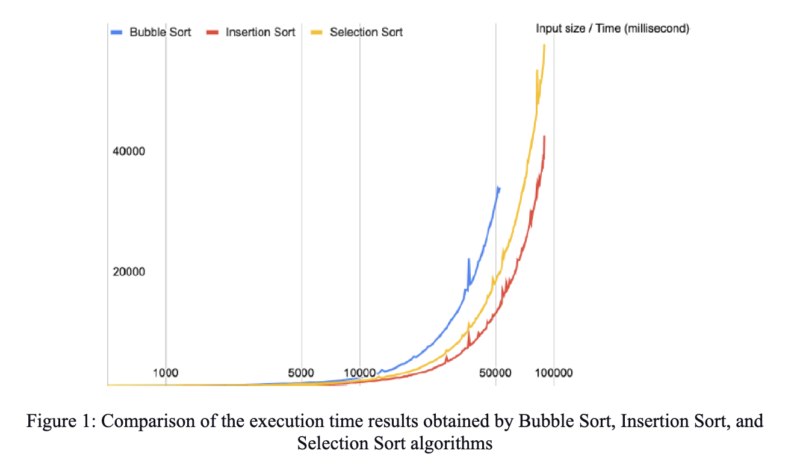
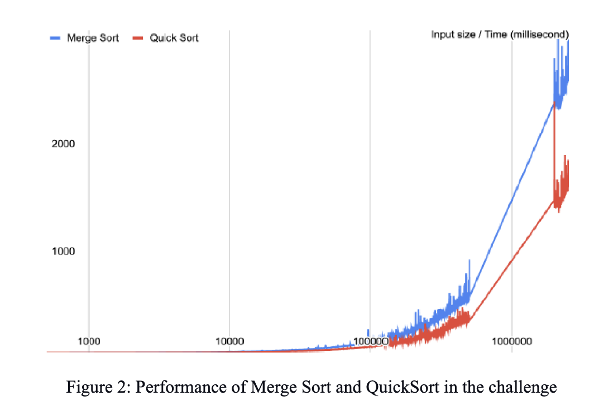
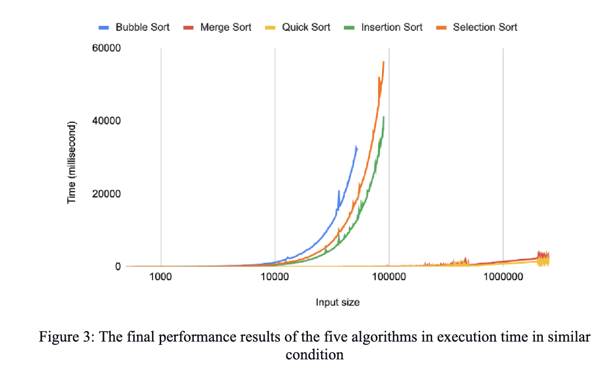

# Performance of sorting algorithms in execution time

## Introduction   

The globalization trends (Bartikowski, 2022; Tang et al., 2022) and widespread use of information technology in scientific research (Fan et al., 2021; Talaoui et al., 2023) and everyday life of the people (Jiang et al., 2022) are expanding the need for use of data processing issues (Talaoui et al., 2023; Tang et al., 2022). The technology and applied scientific research works (Tang et al., 2022) are mainly developed based on data processing and via the solutions developed in computer science. So, this is necessary to enhance the efficient solutions for computational problems (Gupta et al., 2023) to cope with the growing data and increasing use of the applications. In many applications, the processing speed and execution time is the main concern for the users and developers. One of the most crucial tasks in processing and generally in computer science is efficient sorting techniques as the integral component in data processing and querying, searching, and real-time updating (Gupta et al., 2023). Sorting is the rearrangement of input elements of data sets, numerical or string formats in a list or an array, in a desired order (Ferrada, 2022). These sorting algorithms can also be used to speed up the execution performance of the other algorithms (Gupta et al., 2023). There is a variety of sorting algorithms with different performances dependent on various factors such as application requirements, efficiency, memory, and time conditions (Khot and Mishra, 2017). The actual performance of sorting algorithms usually has a direct relation with the number of operations that CPUs need to do for sorting the input (Gupta et al., 2023; Khot and Mishra, 2017). With the increasing demand for fast processing in applications and huge database analyses (Tang et al., 2022; Talaoui et al., 2023), there would be a growing need to optimize the speed and reduce the execution time of the sorting methods (Gupta et al., 2023). Therefore, it would be important to know the speed and the major advantages and disadvantages of the various sorting algorithms (Zutshi and Goswami, 2021).   
In this research, to compare the actual execution time of the algorithms in similar conditions, we selected the five most used sorting algorithms; Bubble Sort, Insertion Sort, Selection Sort, Merge Sort, and QuickSort (Khot and Mishra, 2017; McAllister, 2009; Gupta et al., 2023). Bubble sort is the least complex algorithm in terms of implementation complexity among the cases selected for this research. It cursors any adjacent pair of array elements and they will be swapped if necessary until the array is in sorted order. This algorithm has O(n2) time complexity in both average and worst cases, which makes it a less suitable algorithm for large data sets. Insertion sort is a straightforward sorting algorithm with O(n2) time complexity that makes it a good choice for small datasets, especially if we have a partially sorted input. An array is divided by this algorithm into unsorted and sorted parts. In each step, it picks an element from the unsorted part and puts it in the right place in the sorted part until the array is arranged in the sorted state. Selection sort is similar to Insertion sort but instead of picking one element from an unsorted part and putting it in the right place, it selects the minimum element (in ascending) and places it as the first element in the sorted part. The time complexity is also similar to the insertion sort. Based on the divide and conquer technique, Merge sort divides an array into smaller subarrays and executes the merge operation after sorting them. Although this experiment is using a single-thread application, Merge sort has the capability of running in parallel and it makes it a perfect option for large datasets especially when the dataset is not fit in just one machine. The time complexity of the algorithm is O(nlogn) for the worst and average cases. Quicksort is one of the fastest sorting algorithms. It works through the strategy of applying "iterative" or "recursive" methods, depending on its implementation. The algorithm in the recursive implementation uses the same divide and conquer technique employed by Merge sort, but instead of dividing the array into two halves, it applies a strategy called Pivot element. The goal each time is to place the pivot in its final position. The choice of pivot can significantly reduce the execution time of the algorithm, yet the algorithm has an average time complexity of O(nlogn). (Khot and Mishra, 2017; Zutshi and Goswami, 2021)  
Therefore, the purpose of this research is to compare the actual execution time of five popular sorting algorithms including Bubble Sort, Insertion Sort, Selection Sort, Merge Sort, and QuickSort. This can deepen our understanding of applying the algorithms when speed is the main concern and find out their characteristics, advantages, and disadvantages.

## Methodology 

In this research, to obviate the effects of intervening conditions in the conduction of the experiment for reliable scientific analysis, the same machine was used in all the tests. In the experiment, Java7 was used on a normal computer with an Intel Core i3 processor and 4GB DDR3 memory. A different range of input sizes was considered for these sorting algorithms with the number of experiments for each of them (Table 1). The random dataset used in this experiment generates an arbitrary number of inputs within the range 10-7 and 107. To ensure a reliable result, we made -Djava.compiler = NONE to prevent Java compilers from doing any optimization during the runtime. Despite the attempts for making all else equal by having the same environment during the experiment, the results may be affected by some intervening factors such as hardware, algorithm implementation, programming conditions, operating system, and background processes running during the runtime. However, the results can be replicated by other researchers as a general guideline.  

|                | The number of experiments | Minimum Count | Maximum Count |
|----------------|---------------------------|---------------|---------------|
| Bubble Sort    | 106                       | 500           | 52,500        |
| Insertion Sort | 180                       | 500           | 90,500        |
| Selection Sort | 180                       | 500           | 90,500        |
| Merge Sort     | 1267                      | 500           | 2,534,000     |
| QuickSort      | 1267                      | 500           | 2,534,000     |

## Results 

The performance of the five sorting algorithms in execution time is compared in similar environmental conditions in this experiment. The results of this study can show their main advantages in terms of execution time in the given data sets. The results are also illustrated in the figures. In all the figures x-axis represents time (Milliseconds) and the y-axis is the input size. 
In the Bubble sort, the execution time increased remarkably as the number of objects in the data set exceeded 10,000 elements. While a data set with 52,500 items took 32.72 seconds to sort, data sets with more elements were prevented from completing the operation. The Insertion sort failed to return the sorted data sets with more than 89,500 elements. It can obtain suitable performance in data sets with less than 30,000 elements. Although the Selection sort algorithm works like Insertion sort, it could obtain better performance in comparison to selection sort for both small and large data sets (Figure 1). Therefore, the three algorithms of Bubble Sort, Insertion Sort, and Selection Sort perform weakly for large data sets. 

The algorithms of Merge Sort and QuickSort are challenged by sorting an array with input size from 500 to 2600000 elements in terms of speed. In the experiment, we challenged the Merge sort with an input array with 2,600,000 elements, and it just took 2.621 seconds for the algorithm to sort the entire array. In testing the QuickSort algorithm, we selected the last index of the array as the pivot and provided input with the same size as the merge sort. It could successfully overcome the challenge in just 1.595 seconds (Figure 2). Therefore, the two sorting algorithms of Merge Sort and QuickSort performed suitably for large data sets. 
In figure 3, the performance of the five algorithms is compared in terms of execution time for sorting the same input data sets in relatively similar environmental conditions. According to this illustration, a significant difference can be observed between the two groups of algorithms in doing the sorting operation. 

## Discussion and conclusion 

In comparing the five commonly used sorting algorithms in this study, it was revealed that Bubble sort, Insertion sort, and Selection sort are not suitable for large data sets. They are best suited for small data sets where the speed of the algorithm is not a major concern. The challenge between the two algorithms of Merge Sort and QuickSort also showed that against QuickSort, Merge sort is a stable sorting algorithm. These results can also be confirmed by the statements of McAllister (2009) about the time performance of the algorithms. Therefore, it can be concluded that for large data sets, the overall performance of Merge Sort and QuickSort algorithms are more suitable than that of bubble Sort, Insertion Sort, and Selection Sort. 

## References 

- Bartikowski, B., Laroche, M., Kizgin, H., (2022), Introduction to the Special Issue: Information Communication Technology (ICT): People, culture, and globalization, International Journal of Information Management.  https://www.sciencedirect.com/science/article/pii/S0268401222001256
- Fan, Z., Zhou, H., Chen, Z., Hong, D., Wang, Y., Dong, Q., (2021), Design and Implementation of Scientific Research Big Data Service Platform for Experimental Data Managing, Procedia Computer Science, 192, 3875-3884. https://doi.org/10.1016/j.procs.2021.09.162.
- Gupta, S.K., Singh, D., Choudhary, J., (2023), New GPU Sorting Algorithm Using Sorted Matrix, Procedia Computer Science, 218, 1682-1691. https://doi.org/10.1016/j.procs.2023.01.146.
- Jiang, Y., Ding, X., Liu, D., Gui, X., Zhang, W., Zhang, W., (2022), Designing intelligent self-checkup based technologies for everyday healthy living, International Journal of Human-Computer Studies, 166, 102866. https://doi.org/10.1016/j.ijhcs.2022.102866.
- Khot, A. S. Mishra, R. K., (2017). Learning Functional Data Structures and Algorithms, Pacht Publishing, Birmingham B3 2 PB, UK 
- McAllister, W., (2009). Data Structures and Algorithms Using Java, Jones and Bartlett Publishers, Canada 
- Talaoui, Y., Kohtamäki, M., Ranta, M., Paroutis, S., (2023), Recovering the divide: A review of the big data analytics, strategy relationship, Long Range Planning. https://www.sciencedirect.com/science/article/pii/S0024630122001091 
- Tang, L., Li, J., Du, H., Li, L., Wu, J., Wang, S., (2022), Big Data in Forecasting Research: A Literature Review. Big Data Research 27, 100289. https://doi.org/10.1016/j.bdr.2021.100289.
